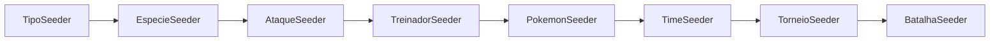

<p align="center">
  
</p>

# 🏆 BD Pokémon Tournament

<div align="center">


**Projeto acadêmico desenvolvido para a disciplina de Banco de Dados I**  

</div>

---

## 📚 Navegação da Documentação

<table>
  <tr>
    <td align="center" width="25%">
      <a href="docs/esquema-bd.md">
        <b>🧠 Esquema do BD</b><br/>
        <sub>Diagrama ER e Modelo Conceitual</sub>
      </a>
    </td>
    <td align="center" width="25%">
      <a href="docs/dicionario-de-dados.md">
        <b>📚 Dicionário de Dados</b><br/>
        <sub>Especificação de Tabelas e Campos</sub>
      </a>
    </td>
    <td align="center" width="25%">
      <a href="docs/povoamento-seeders.md">
        <b>🌱 Povoamento/Seeders</b><br/>
        <sub>Como os Dados são Inseridos</sub>
      </a>
    </td>
    <td align="center" width="25%">
      <a href="docs/views-sql.md">
        <b>📊 Views SQL</b><br/>
        <sub>Consultas Otimizadas e Views</sub>
      </a>
    </td>
  </tr>
</table>

---

## 📑 Índice

- [👥 Integrantes do Projeto](#-integrantes-do-projeto)
- [🚀 Como Rodar o Projeto](#-como-rodar-o-projeto)
- [🔐 Autenticação (JWT)](#-autenticação-jwt)
- [🗄️ Estrutura do Banco de Dados](#️-estrutura-do-banco-de-dados)
- [🌱 Povoamento do Banco de Dados](#-povoamento-do-banco-de-dados)
- [❓ FAQ / Troubleshooting](#-faq--troubleshooting)
- [🛠️ Tecnologias Utilizadas](#️-tecnologias-utilizadas)
- [📝 Credenciais de Desenvolvimento](#-credenciais-de-desenvolvimento)
- [📞 Contato](#-contato)

---

## 👥 Integrantes do Projeto

<table>
  <tr>
    <td align="center">
      <a href="https://github.com/alinesors" title="Perfil da Aline">
        <br>
        <sub><b>Aline Fernanda Soares Silva</b></sub><br>
        <sub>@alinesors</sub>
      </a>
    </td>
    <td align="center">
      <a href="https://github.com/Arthur-789" title="Perfil do Arthur">
        <br>
        <sub><b>Arthur Roberto Araújo Tavares</b></sub><br>
        <sub>@Arthur-789</sub>
      </a>
    </td>
    <td align="center">
      <a href="https://github.com/ClaudersonXavier" title="Perfil do Clauderson">
        <br>
        <sub><b>Clauderson Branco Xavier</b></sub><br>
        <sub>@ClaudersonXavier</sub>
      </a>
    </td>
    <td align="center">
      <a href="https://github.com/Victor-Saraiva-P" title="Perfil do Victor">
        <br>
        <sub><b>Victor Alexandre Saraiva Pimentel</b></sub><br>
        <sub>@Victor-Saraiva-P</sub>
      </a>
    </td>
  </tr>
</table>

---

## 🚀 Como Rodar o Projeto

### Pré-requisitos

Antes de começar, certifique-se de ter instalado:

- ✅ **Docker** 
- ✅ **Docker Compose** 

### Instalação e Execução

#### **1️⃣ (Opcional) Configure as variáveis de ambiente**

```bash
cp .env.example .env
```

#### **2️⃣ Inicie toda a stack com Docker Compose**

```bash
docker compose up --build
```

> 🔄 **Nota:** O primeiro build pode levar alguns minutos. Builds subsequentes serão mais rápidos.  
> O serviço frontend é construído a partir do `frontend/Dockerfile` e inicia em modo de desenvolvimento.

#### **3️⃣ Acesse as aplicações**

| Serviço  | URL                      | Descrição                 |
|----------|--------------------------|---------------------------|
| Frontend | http://localhost:4200    | Interface Angular         |
| Backend  | http://localhost:8080    | API REST Spring Boot      |
| Database | 5433:5432       | PostgreSQL (via cliente)  |

### Comandos Docker Úteis

```bash
# Parar todos os containers
docker compose down

# Ver logs em tempo real
docker compose logs -f

# Ver status dos containers
docker compose ps

# Acessar shell do container do backend
docker compose exec backend bash

# Acessar shell do container do banco de dados
docker compose exec db psql -U dev -d projeto_banquinho
```

---

## 🔐 Autenticação (JWT)

A API usa autenticação via **JWT Bearer Token**.
Os endpoints em `/api/auth/**` são públicos para login/registro, e os demais endpoints (exceto estatísticas públicas) exigem token.

### Endpoints de autenticação

| Método | Endpoint | Auth | Descrição |
|--------|----------|------|-----------|
| `GET` | `/api/auth/test` | Não | Health-check da API |
| `POST` | `/api/auth/login` | Não | Login por e-mail e senha |
| `POST` | `/api/auth/registro` | Não | Cadastro de treinador |
| `PUT` | `/api/auth/change-password` | Sim | Altera senha do usuário autenticado |
| `PUT` | `/api/auth/update-nome` | Sim | Atualiza nome do usuário autenticado |

### Exemplo de login

```bash
curl -X POST http://localhost:8080/api/auth/login \
  -H "Content-Type: application/json" \
  -d '{
    "email": "ash@pokemon.com",
    "senha": "ash123"
  }'
```

### Resposta de sucesso

```json
{
  "token": "<jwt>",
  "tipo": "Bearer",
  "id": 2,
  "nome": "Ash Ketchum",
  "email": "ash@pokemon.com",
  "admin": false
}
```

### Exemplos de Credenciais seed (desenvolvimento)

| Perfil | E-mail | Senha |
|--------|--------|-------|
| Admin | `admin@pokemon.com` | `123456` |
| Treinador | `ash@pokemon.com` | `ash123` |
| Treinador | `misty@pokemon.com` | `misty123` |
| Treinador | `brock@pokemon.com` | `brock123` |
| Treinador | `gary@pokemon.com` | `gary123` |

---

## 🗄️ Estrutura do Banco de Dados

### Esquema Conceitual (Modelo ER)


> 📘 **Documentação detalhada:** [Ver Esquema do BD completo](docs/esquema-bd.md)

### Visão Geral do Modelo

O modelo de dados foi projetado seguindo princípios de **normalização** e **integridade referencial**, cobrindo:

- 👤 **Treinadores** e seus **Pokémons** capturados
- 👥 **Times** compostos por até 6 Pokémons
- 🏆 **Torneios** com múltiplas **batalhas**
- 🔗 **Relacionamentos N:N** através de tabelas associativas

### Entidades Principais

| Entidade     | Descrição                                        | Detalhes                                          |
|--------------|--------------------------------------------------|---------------------------------------------------|
| `treinador`  | Treinadores cadastrados no sistema              | 🔗 [Ver especificação](docs/dicionario-de-dados.md#tabela-treinador) |
| `pokemon`    | Instâncias de Pokémon (pertencentes a treinadores) | 🔗 [Ver especificação](docs/dicionario-de-dados.md#tabela-pokemon) |
| `especie`    | Espécies de Pokémon (Pikachu, Charizard, etc.)  | 🔗 [Ver especificação](docs/dicionario-de-dados.md#tabela-especie) |
| `ataque`     | Movimentos/ataques disponíveis                   | 🔗 [Ver especificação](docs/dicionario-de-dados.md#tabela-ataque) |
| `tipo`       | Tipos elementais (Fire, Water, Grass, etc.)      | 🔗 [Ver especificação](docs/dicionario-de-dados.md#tabela-tipo) |
| `time`       | Equipes montadas para competição                | 🔗 [Ver especificação](docs/dicionario-de-dados.md#tabela-time) |
| `torneio`    | Competições organizadas                          | 🔗 [Ver especificação](docs/dicionario-de-dados.md#tabela-torneio) |
| `batalha`    | Confrontos entre times                           | 🔗 [Ver especificação](docs/dicionario-de-dados.md#tabela-batalha) |

### Tabelas Associativas (Relacionamentos N:N)

- `especie_tipos` - Tipos de cada espécie (ex: Charizard é Fire + Flying)
- `pokemon_ataques` - Ataques aprendidos por cada Pokémon (máximo 4)
- `time_pokemons` - Pokémons que compõem cada time (máximo 6)
- `torneio_times` - Times inscritos em cada torneio
- `batalha_times_participantes` - Times participantes de cada batalha

> 📘 **Documentação completa:** [Dicionário de Dados](docs/dicionario-de-dados.md) | [Esquema do BD](docs/esquema-bd.md)

### Views SQL Disponíveis

O projeto inclui **3 views otimizadas** para consultas frequentes:

| View                              | Descrição                                    |
|-----------------------------------|----------------------------------------------|
| `v_resumo_batalhas_torneio`       | Resumo completo de batalhas por torneio     |
| `v_time_pokemons_detalhado`       | Composição detalhada de times               |
| `v_treinador_desempenho_torneio`  | Desempenho de treinadores em torneios      |

> 📊 **Ver exemplos de uso:** [Views SQL](docs/views-sql.md)

---

## 🌱 Povoamento do Banco de Dados

O banco de dados é populado **automaticamente** através de **seeders** implementados em Java usando:

- 🍃 **Spring Boot + JPA + WebClient**
- 🎮 **Dados da [PokeAPI](https://pokeapi.co/)** (tipos, espécies, ataques)
- 🎲 **Dados mockados** (treinadores, torneios, batalhas)

> 📘 **Documentação completa:** [Povoamento e Seeders](docs/povoamento-seeders.md)

### Como Popular o Banco

#### **Opção 1: Automático (ao iniciar com Docker)**

O banco é populado automaticamente quando você executa:

```bash
docker compose up --build
```

#### **Opção 2: Manual via SeedRunner**

Execute o **SeedRunner** pela sua IDE:

```bash
backend/src/main/java/com/ufape/projetobanquinhobd/seeder/SeedRunner.java
# Clique com botão direito → Run 'SeedRunner.main()'
```

### Ordem de Execução dos Seeders

Os seeders são executados na seguinte ordem (respeitando dependências):



**Sequência de execução:**
1. **TipoSeeder** → Tipos elementais (Fire, Water, Grass, etc.)
2. **EspecieSeeder** → Espécies de Pokémon
3. **AtaqueSeeder** → Movimentos/ataques
4. **TreinadorSeeder** → Treinadores
5. **PokemonSeeder** → Instâncias de Pokémon
6. **TimeSeeder** → Times/equipes
7. **TorneioSeeder** → Torneios
8. **BatalhaSeeder** → Batalhas

### Volume de Dados Inseridos

| Entidade      | Quantidade | Fonte       |
|---------------|------------|-------------|
| Tipos         | 18         | PokeAPI     |
| Espécies      | 50         | PokeAPI     |
| Ataques       | 50         | PokeAPI     |
| Treinadores   | 4          | Mock data   |
| Pokémons      | 24         | Mock data   |
| Times         | 4          | Mock data   |
| Torneios      | 2          | Mock data   |
| Batalhas      | 6          | Mock data   |

**Treinadores cadastrados:**
- 🧢 Ash Ketchum
- 💧 Misty Waterflower
- 🪨 Brock Harrison
- ⚡ Gary Oak

> 📘 **Detalhes técnicos:** [Ver documentação completa de seeders](docs/povoamento-seeders.md)

---

## ❓ FAQ / Troubleshooting

### Problemas Comuns

<details>
<summary><b>❌ A porta 5433 já está em uso</b></summary>

Se você já tem PostgreSQL rodando na porta padrão, pode alterar a porta no `.env`:

```env
POSTGRES_PORT=5434
```

Depois reinicie os containers:

```bash
docker compose down
docker compose up --build
```
</details>

<details>
<summary><b>❌ O frontend não carrega ou mostra erro de CORS</b></summary>

1. Verifique se o backend está rodando corretamente:
   ```bash
   docker compose logs backend
   ```

2. Certifique-se que a porta 8080 está livre:
   ```bash
   netstat -ano | findstr :8080
   ```

3. Reinicie os serviços:
   ```bash
   docker compose restart backend frontend
   ```
</details>

<details>
<summary><b>🔄 Como resetar completamente o banco de dados?</b></summary>

Para limpar todos os dados e recriar o banco:

```bash
docker compose down -v
docker compose up --build
```

⚠️ **Atenção:** Isso irá apagar **todos os dados** e executar os seeders novamente.
</details>

<details>
<summary><b>👀 Como visualizar os dados do banco?</b></summary>

**Opção 1: Prisma Studio** (recomendado)

```bash
cd backend/db-schema
npx prisma studio
```

**Opção 2: Cliente PostgreSQL (pgAdmin, DBeaver, etc.)**

Use as credenciais listadas na seção [Credenciais de Desenvolvimento](#-credenciais-de-desenvolvimento).
</details>

<details>
<summary><b>🐌 Os seeders estão muito lentos</b></summary>

O tempo normal de execução é de 30-60 segundos. Se estiver mais lento:

1. Verifique sua conexão com a internet (PokeAPI)
2. Verifique os logs:
   ```bash
   docker compose logs -f backend
   ```

> 📘 **Ver mais informações:** [Povoamento e Seeders](docs/povoamento-seeders.md#-configurações-avançadas)
</details>

<details>
<summary><b>📚 Onde encontro a documentação completa?</b></summary>

Use a [navegação no topo](#-navegação-da-documentação) deste documento para acessar:

- **Esquema do BD:** Modelo ER e relações
- **Dicionário de Dados:** Especificação de todas as tabelas
- **Povoamento/Seeders:** Como os dados são inseridos
- **Views SQL:** Consultas otimizadas e views disponíveis
</details>

---

## 📝 Credenciais de Desenvolvimento

- As credenciais de desenvolvimento estao no arquivo .env.example da raiz e sao consumidas pelo docker-compose.yml da raiz e por backend/src/main/resources/application.properties

| Parâmetro       | Valor               |
|-----------------|---------------------|
| **Host**        | `localhost`         |
| **Porta**       | `5433`              |
| **Database**    | `projeto_banquinho` |
| **Usuário**     | `dev`               |
| **Senha**       | `dev`               |

---

## 📞 Contato

Para dúvidas, sugestões ou contribuições, entre em contato com qualquer um dos integrantes através dos perfis do GitHub listados na seção [Integrantes do Projeto](#-integrantes-do-projeto).

---

<div align="center">

### 📚 Documentação Relacionada

<table>
  <tr>
    <td align="center">
      <a href="docs/esquema-bd.md">
        <b>🧠 Esquema do BD</b>
      </a>
    </td>
    <td align="center">
      <a href="docs/dicionario-de-dados.md">
        <b>📚 Dicionário de Dados</b>
      </a>
    </td>
    <td align="center">
      <a href="docs/povoamento-seeders.md">
        <b>🌱 Povoamento/Seeders</b>
      </a>
    </td>
    <td align="center">
      <a href="docs/views-sql.md">
        <b>📊 Views SQL</b>
      </a>
    </td>
  </tr>
</table>

---

### ⚖️ Licença

Este projeto foi desenvolvido para fins educacionais.  
Pokémon e todos os personagens relacionados são © da Nintendo/Game Freak.

---

[⬆️ Voltar ao topo](#-bd-pokémon-tournament)

</div>
